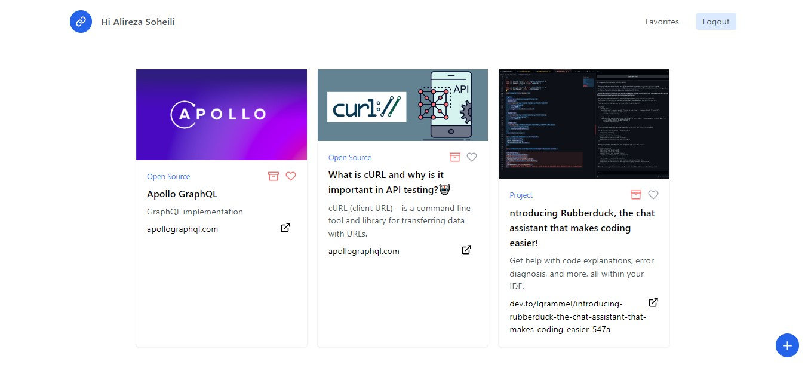
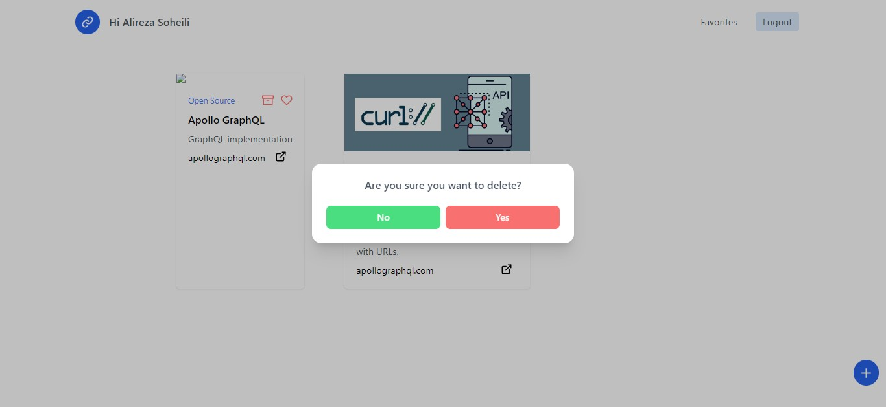
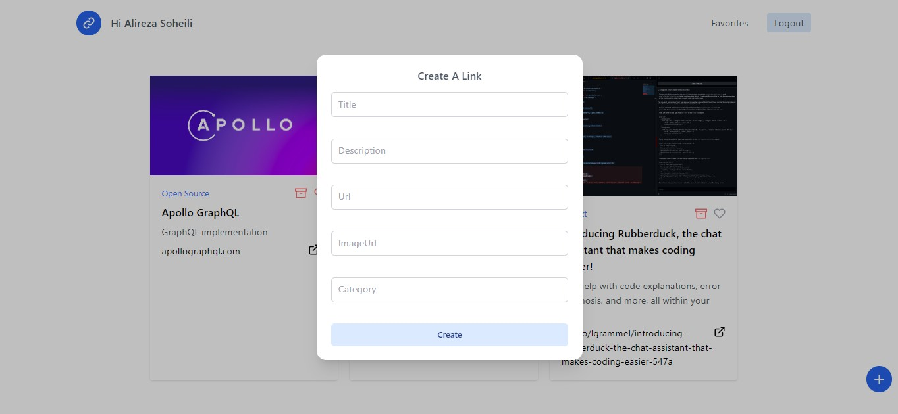

# Awesome-links

You can save your links and add them to favorites

# Description

A simple app that help you to save and orginize your bookmarks that uses prisma for db , Apollo server and pothos for handling server and urql for handling client 

## Screenshots






## Tech Stack

<a href="https://reactjs.org/" target="_blank" rel="noreferrer"></a>
<a href="https://www.typescriptlang.org/" target="_blank" rel="noreferrer"></a>
<a href="https://nextjs.org/docs" target="_blank" rel="noreferrer"></a>
<a href="https://tailwindcss.com/" target="_blank" rel="noreferrer"></a>
<a href="https://graphql.org/" target="_blank" rel="noreferrer"></a>

### Pothos-graphql, urql, prisma, Apollo Server

**DB:** postgres localy

## Run Locally

Clone the project

```bash
  git clone https://github.com/alireza-constantin/roundest-poki
```

Go to the project directory

```bash
  cd roundest-poki
```

Install dependencies

```bash
  npm install
``` 

## Create .env file

then enter your database url, client_secret and id for discord and google providers in .env file for more information about authentication please go to [Next Auth documant](https://next-auth.js.org/)

```code
    DATABASE_URL=
    DISCORD_CLIENT_ID=
    DISCORD_CLIENT_SECRET=
    GOOGLE_CLIENT_ID=
    GOOGLE_CLIENT_SECRET=
```

Start the development server

```bash
  npm run dev
```

## Deploy on Vercel

The easiest way to deploy your Next.js app is to use the [Vercel Platform](https://vercel.com/new?utm_medium=default-template&filter=next.js&utm_source=create-next-app&utm_campaign=create-next-app-readme) from the creators of Next.js.

Check out our [Next.js deployment documentation](https://nextjs.org/docs/deployment) for more details.
